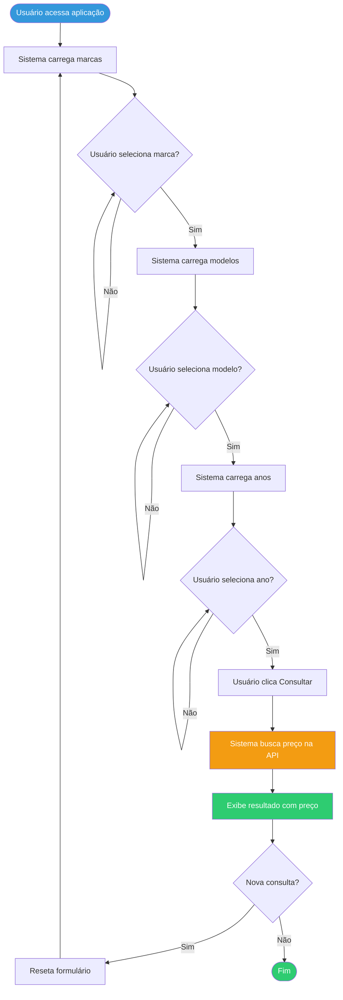
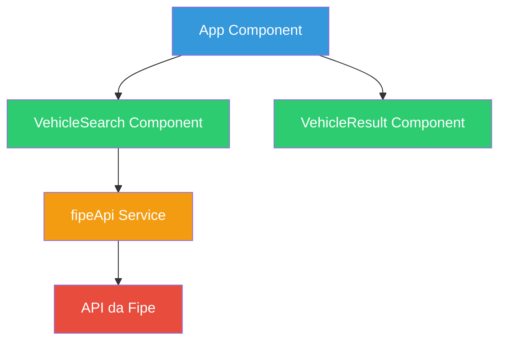
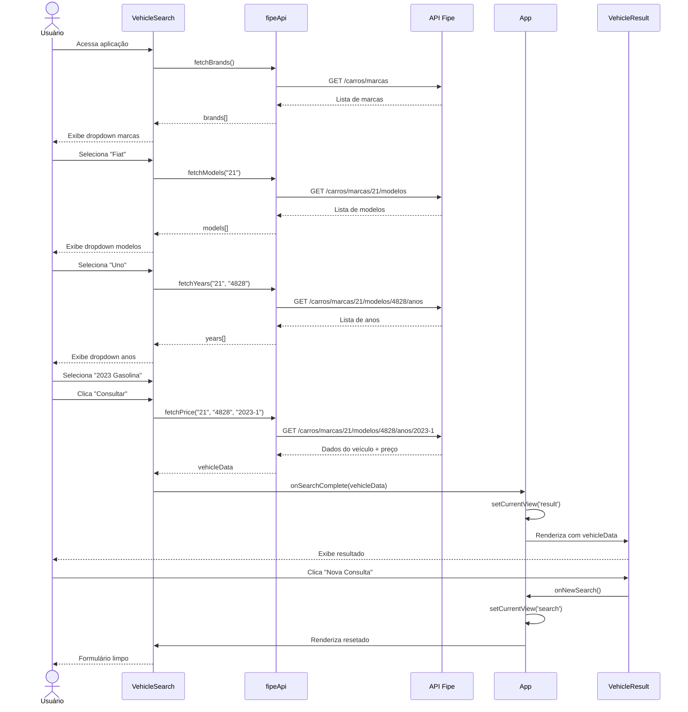
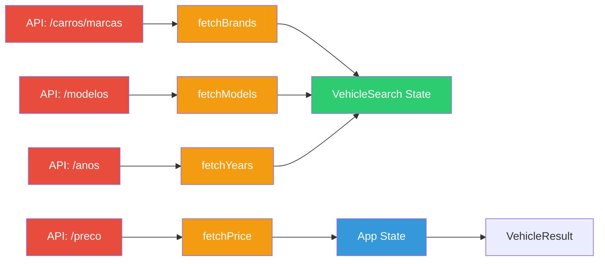
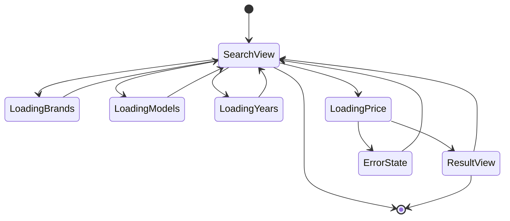
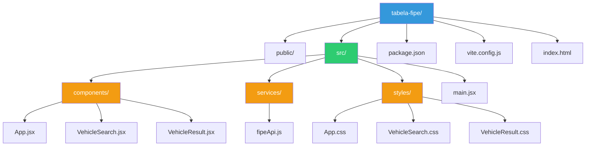
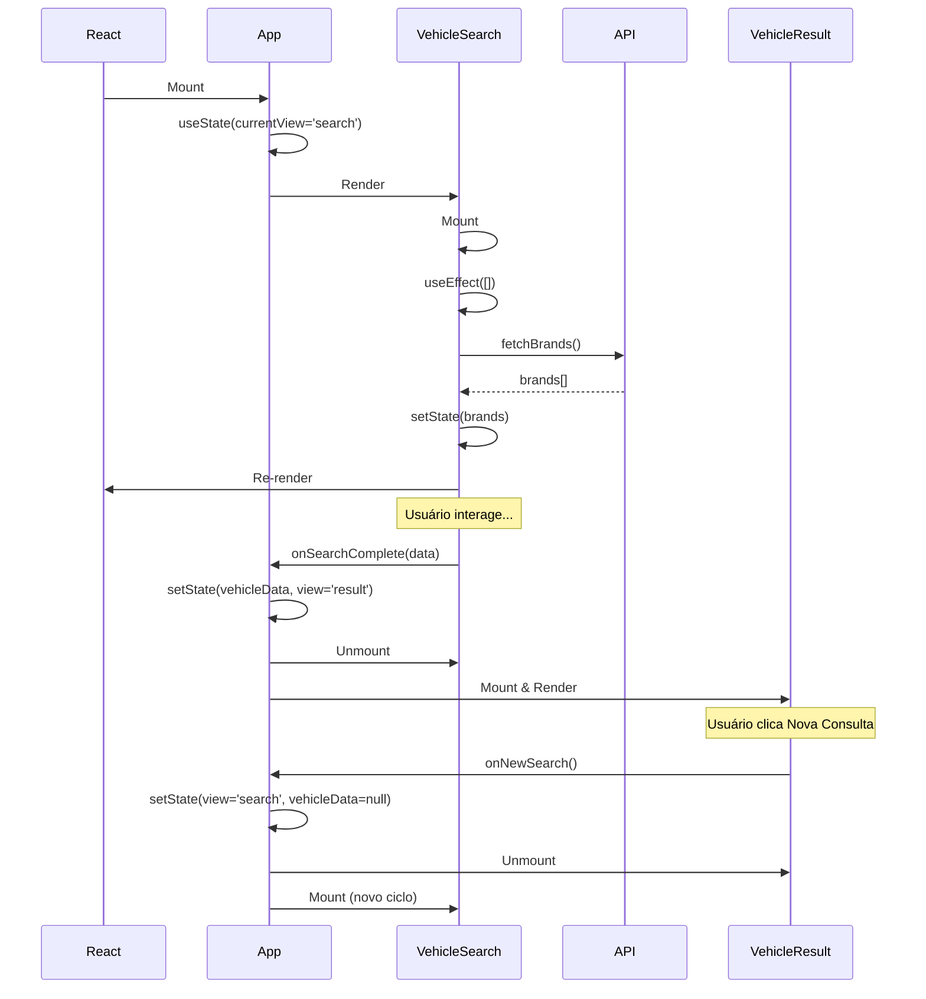
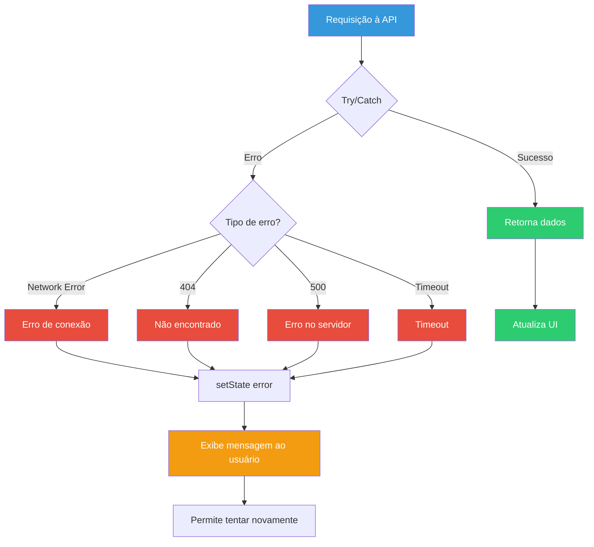
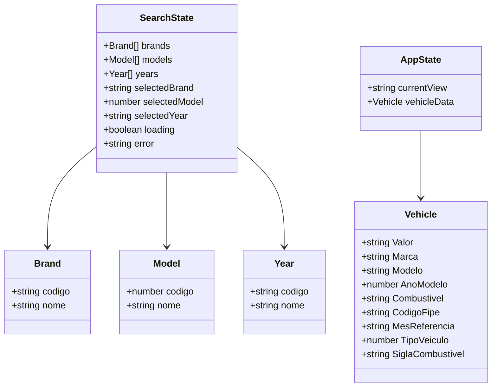
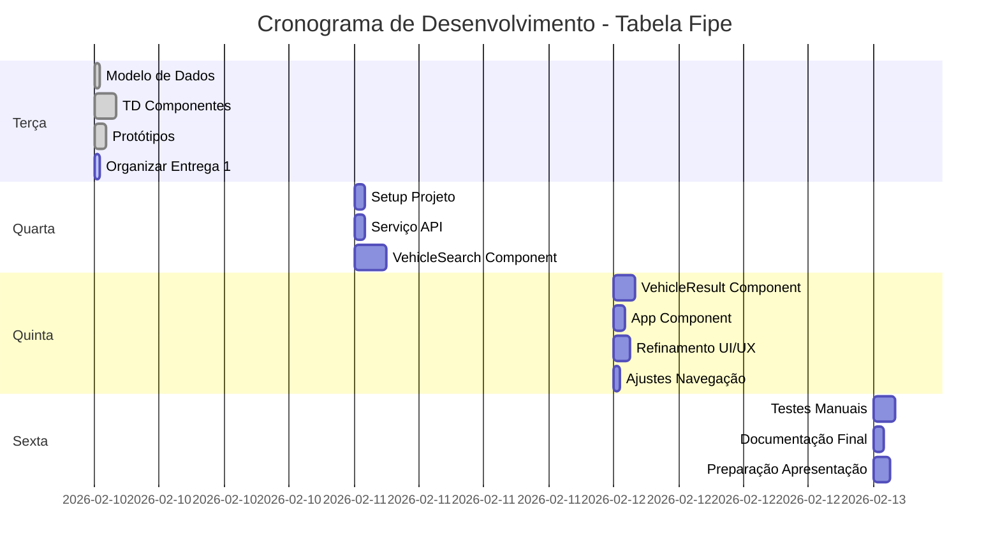

# Diagramas Técnicos - Tabela Fipe

## 1. Fluxograma do Usuário

---

## 2. Arquitetura de Componentes

---

## 3. Diagrama de Sequência - Consulta de Veículo

---

## 4. Fluxo de Dados

---

## 5. Diagrama de Estados da Aplicação

---

## 6. Estrutura de Pastas do Projeto

---

## 7. Ciclo de Vida dos Componentes

---

## 8. Tratamento de Erros

---

## 9. Modelo de Dados (Entidades)

---

## 10. Cronograma de Implementação

---

## Como Visualizar os Diagramas

### Opção 1: GitHub/GitLab
- Faça commit deste arquivo
- GitHub e GitLab renderizam Mermaid automaticamente

### Opção 2: Mermaid Live Editor
1. Acesse: https://mermaid.live
2. Cole o código de cada diagrama
3. Exporte como PNG ou SVG

### Opção 3: VS Code
1. Instale extensão "Markdown Preview Mermaid Support"
2. Abra este arquivo
3. Ctrl+Shift+V para preview

### Opção 4: Notion/Confluence
- Ambos suportam blocos Mermaid
- Cole o código em um bloco de código com linguagem "mermaid"

---

## Resumo dos Diagramas

1. ✅ **Fluxograma do Usuário** - Jornada completa
2. ✅ **Arquitetura de Componentes** - Estrutura React
3. ✅ **Diagrama de Sequência** - Interações detalhadas
4. ✅ **Fluxo de Dados** - Como dados fluem
5. ✅ **Diagrama de Estados** - Estados da aplicação
6. ✅ **Estrutura de Pastas** - Organização do código
7. ✅ **Ciclo de Vida** - Lifecycle dos componentes
8. ✅ **Tratamento de Erros** - Como erros são tratados
9. ✅ **Modelo de Dados** - Classes e entidades
10. ✅ **Cronograma** - Timeline de implementação

